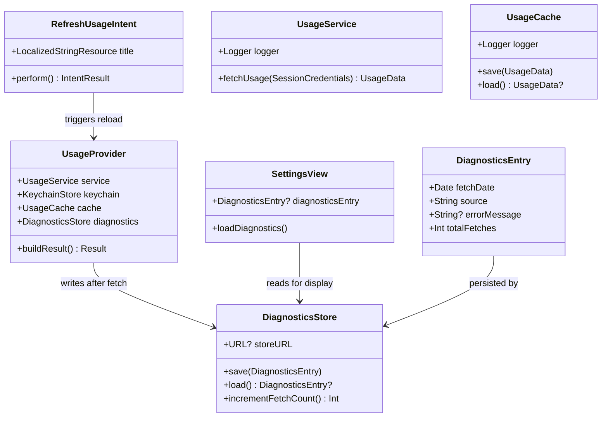

# Widget Force-Refresh Button and Observability

## Requirements

Implement a force-refresh mechanism in the WidgetKit extension via an interactive `AppIntent` button, and add structured observability (OS-level logging + a lightweight diagnostics store) across the fetch pipeline so failures and cache usage are visible in Console.app and in the host app's settings screen.

## Entities



## Approach

1. Force-Refresh via AppIntent:
   - Add `RefreshUsageIntent: AppIntent` to the `Shared/` layer so both the widget extension and app targets can reference it
   - Place an interactive `Button(intent: RefreshUsageIntent())` in `SmallWidgetView` and `MediumWidgetView` — WidgetKit on macOS 26 supports `Button(intent:)` in `StaticConfiguration` without migrating to `AppIntentConfiguration`
   - The intent calls `WidgetCenter.shared.reloadTimelines(ofKind: BundleIdentifiers.widgetKind)` — no deep-link round-trip through the host app required
   - Add `widgetKind` constant to `BundleIdentifiers` to keep the kind string in one place

2. Structured Logging:
   - Use `os.Logger` (subsystem: `BundleIdentifiers.base`, categories matching the class name) in `UsageService`, `UsageCache`, and `UsageProvider`
   - Log fetch attempts, HTTP status codes, cache hits/misses, timeline scheduling decisions, and errors — visible in Console.app filtered by subsystem
   - No UI changes required for logging; it is purely operational

3. Diagnostics Store (lightweight fetch metadata):
   - `DiagnosticsStore` follows the same App Group container pattern as `UsageCache`; it stores the latest `DiagnosticsEntry` as JSON at `diagnostics.json`
   - `UsageProvider.buildResult()` writes a `DiagnosticsEntry` at the end of every fetch — recording date, whether data came from live API or cache, and any error message
   - `SettingsView` reads `DiagnosticsStore` on appear and shows a read-only diagnostics section below the credential form

## Structure

### New Files
1. `Shared/Intents/RefreshUsageIntent.swift` — AppIntent that reloads the widget timeline
2. `Shared/Models/DiagnosticsEntry.swift` — Codable model for one fetch result
3. `Shared/Services/DiagnosticsStore.swift` — App Group-backed persistence for DiagnosticsEntry

### Modified Files
1. `Shared/Constants.swift` — add `BundleIdentifiers.widgetKind`
2. `Shared/Services/UsageService.swift` — add `os.Logger`
3. `Shared/Services/UsageCache.swift` — add `os.Logger`
4. `Widget/Provider/UsageProvider.swift` — inject `DiagnosticsStore`, write entry after buildResult; add `os.Logger`
5. `Widget/Views/SmallWidgetView.swift` — add refresh button (bottom-right corner overlay)
6. `Widget/Views/MediumWidgetView.swift` — add refresh button (bottom-right of right panel)
7. `App/SettingsView.swift` — add diagnostics section

### Dependencies
1. `RefreshUsageIntent` depends on `BundleIdentifiers.widgetKind`
2. `UsageProvider` depends on `DiagnosticsStore` (injected, defaulting to `DiagnosticsStore()`)
3. `SettingsView` depends on `DiagnosticsStore` (instantiated locally on appear)
4. `SmallWidgetView` and `MediumWidgetView` depend on `RefreshUsageIntent`

### Layered Architecture
1. Intent Layer: `RefreshUsageIntent` — fires timeline reload from within the extension
2. Provider Layer: `UsageProvider` — orchestrates fetch, cache, diagnostics write
3. Service Layer: `UsageService`, `UsageCache`, `DiagnosticsStore` — each logs internally
4. View Layer: widget views add button; `SettingsView` shows diagnostics

## Operations

### Update Constants — `BundleIdentifiers`
1. Responsibility: Centralize the widget kind string so `ClaudeUsageWidget.swift` and `RefreshUsageIntent` share it
2. Change:
   - Add `static let widgetKind = "ClaudeUsageWidget"` to `BundleIdentifiers`
3. Update `ClaudeUsageWidget.swift`:
   - Change `let kind = "ClaudeUsageWidget"` to `let kind = BundleIdentifiers.widgetKind`

### Create AppIntent — `RefreshUsageIntent`
File: `ClaudeUsageWidget/Shared/Intents/RefreshUsageIntent.swift`

1. Responsibility: Provide an interactive button action that forces the widget to reload its timeline
2. Imports: `AppIntents`, `WidgetKit`
3. Definition:
   ```swift
   struct RefreshUsageIntent: AppIntent {
       static let title: LocalizedStringResource = "Refresh Claude Usage"

       func perform() async throws -> some IntentResult {
           WidgetCenter.shared.reloadTimelines(ofKind: BundleIdentifiers.widgetKind)
           return .result()
       }
   }
   ```
4. Target membership: `ClaudeUsageWidgetApp` + `ClaudeUsageWidgetExtension` (add to both in `project.yml` under `Shared/`)

### Create Model — `DiagnosticsEntry`
File: `ClaudeUsageWidget/Shared/Models/DiagnosticsEntry.swift`

1. Responsibility: Represent metadata from a single fetch cycle for display and persistence
2. Definition:
   ```swift
   struct DiagnosticsEntry: Codable {
       enum Source: String, Codable { case live, cached }
       let fetchDate: Date
       let source: Source
       let errorMessage: String?
       let totalFetches: Int
   }
   ```
3. No mutable state; always constructed fresh and persisted by `DiagnosticsStore`

### Create Service — `DiagnosticsStore`
File: `ClaudeUsageWidget/Shared/Services/DiagnosticsStore.swift`

1. Responsibility: Persist and retrieve the latest `DiagnosticsEntry` in the App Group container
2. Pattern: mirrors `UsageCache` — atomic file write, no versioned envelope needed (entry is append-on-write, not migrated)
3. Attributes:
   - `storeURL: URL?` — `FileManager.default.containerURL(forSecurityApplicationGroupIdentifier: BundleIdentifiers.appGroup)?.appendingPathComponent("diagnostics.json")`
4. Methods:
   - `save(_ entry: DiagnosticsEntry) throws`:
     - Encode with `JSONEncoder.usageEncoder`, write atomically
   - `load() -> DiagnosticsEntry?`:
     - Read data from `storeURL`, decode with `JSONDecoder.usageDecoder`; return nil on any failure
   - `nextFetchCount() -> Int`:
     - Load existing entry, return `(existing?.totalFetches ?? 0) + 1`
5. Test seam: `init(storeURL: URL)` for tests
6. Target membership: `ClaudeUsageWidgetApp` + `ClaudeUsageWidgetExtension`

### Update Service — `UsageService` (add logging)
File: `ClaudeUsageWidget/Shared/Services/UsageService.swift`

1. Add `import OSLog` at the top
2. Add private logger: `private let logger = Logger(subsystem: BundleIdentifiers.base, category: "UsageService")`
3. Logging points in `fetchUsage(credentials:)`:
   - Before request: `logger.debug("Fetching usage from \(url.absoluteString, privacy: .public)")`
   - On HTTP 200: `logger.info("Fetch succeeded")`
   - On 401/403: `logger.warning("Unauthenticated — session token may be expired")`
   - On 429: `logger.warning("Rate limited; retry-after=\(delay)")`
   - On network error: `logger.error("Network error: \(error.localizedDescription, privacy: .public)")`
   - On other status: `logger.error("Unexpected HTTP \(http.statusCode)")`
   - On decoding error: `logger.error("Decoding failed: \(error.localizedDescription, privacy: .public)")`

### Update Service — `UsageCache` (add logging)
File: `ClaudeUsageWidget/Shared/Services/UsageCache.swift`

1. Add `import OSLog`
2. Add private logger: `private let logger = Logger(subsystem: BundleIdentifiers.base, category: "UsageCache")`
3. Logging points in `save(_:)`: `logger.debug("Cache written")`
4. Logging points in `load()`:
   - On cache miss (no file): `logger.debug("Cache miss — no file")`
   - On version mismatch or decode error: `logger.warning("Cache invalid — dropping file")`
   - On expired cache: `logger.info("Cache expired — dropping file")`
   - On success: `logger.debug("Cache hit, age=\(age)s")`

### Update Provider — `UsageProvider` (diagnostics + logging)
File: `ClaudeUsageWidget/Widget/Provider/UsageProvider.swift`

1. Add `import OSLog`
2. Add `private let diagnostics: DiagnosticsStore` to stored properties
3. Update `init` signature: add `diagnostics: DiagnosticsStore = DiagnosticsStore()`
4. Add private logger: `private let logger = Logger(subsystem: BundleIdentifiers.base, category: "UsageProvider")`
5. At start of `buildResult()`: `let fetchCount = diagnostics.nextFetchCount()`; `logger.info("buildResult starting, fetch #\(fetchCount)")`
6. After each return path in `buildResult()`, write diagnostics before returning:

   - Success path:
     ```swift
     try? diagnostics.save(DiagnosticsEntry(
         fetchDate: Date(), source: .live, errorMessage: nil, totalFetches: fetchCount))
     logger.info("Timeline scheduled for \(refreshDate, privacy: .public)")
     ```
   - Cached (rate-limited or network error) path:
     ```swift
     try? diagnostics.save(DiagnosticsEntry(
         fetchDate: Date(), source: .cached, errorMessage: error.localizedDescription, totalFetches: fetchCount))
     ```
   - Error (no cache) path:
     ```swift
     try? diagnostics.save(DiagnosticsEntry(
         fetchDate: Date(), source: .cached, errorMessage: message, totalFetches: fetchCount))
     ```
   - Unauthenticated: no diagnostics write (not a fetch failure, a configuration state)

### Update View — `SmallWidgetView` (refresh button)
File: `ClaudeUsageWidget/Widget/Views/SmallWidgetView.swift`

1. Wrap existing `VStack` in a `ZStack`:
   ```swift
   ZStack(alignment: .bottomTrailing) {
       VStack(spacing: 4) { ... }  // existing content unchanged
       Button(intent: RefreshUsageIntent()) {
           Image(systemName: "arrow.clockwise")
               .font(.system(size: 9))
               .foregroundStyle(.tertiary)
       }
       .buttonStyle(.plain)
       .padding(4)
   }
   ```
2. Add `import AppIntents` at the top

### Update View — `MediumWidgetView` (refresh button)
File: `ClaudeUsageWidget/Widget/Views/MediumWidgetView.swift`

1. In the right-panel `VStack`, replace the `Spacer` + `Text("Updated …")` footer with:
   ```swift
   Spacer(minLength: 0)
   HStack {
       Text("Updated \(usage.lastUpdated, style: .relative) ago")
           .font(.system(size: 9))
           .foregroundStyle(.secondary)
       Spacer(minLength: 4)
       Button(intent: RefreshUsageIntent()) {
           Image(systemName: "arrow.clockwise")
               .font(.system(size: 9))
               .foregroundStyle(.tertiary)
       }
       .buttonStyle(.plain)
   }
   ```
2. Add `import AppIntents` at the top

### Update View — `SettingsView` (diagnostics section)
File: `ClaudeUsageWidget/App/SettingsView.swift`

1. Add `@State private var diagnosticsEntry: DiagnosticsEntry? = nil` to stored state
2. Add private `let diagnosticsStore = DiagnosticsStore()` alongside `let keychain`
3. Add a new `Section` after the credentials section:
   ```swift
   Section("Diagnostics") {
       if let entry = diagnosticsEntry {
           LabeledContent("Last fetch", value: entry.fetchDate, format: .dateTime)
           LabeledContent("Source", value: entry.source == .live ? "Live" : "Cached")
           LabeledContent("Fetch count", value: entry.totalFetches, format: .number)
           if let err = entry.errorMessage {
               Text(err)
                   .font(.caption)
                   .foregroundStyle(.red)
           }
       } else {
           Text("No fetch data yet")
               .foregroundStyle(.secondary)
               .font(.caption)
       }
   }
   ```
4. In `loadExistingState()`, add: `diagnosticsEntry = diagnosticsStore.load()`
5. Add a "Refresh" button to the actions section that calls `WidgetCenter.shared.reloadAllTimelines()` and `diagnosticsEntry = diagnosticsStore.load()` after a short delay

### Update `project.yml` (target membership for new files)
1. Under `ClaudeUsageWidgetApp` sources, add:
   - `ClaudeUsageWidget/Shared/Intents/RefreshUsageIntent.swift`
   - `ClaudeUsageWidget/Shared/Models/DiagnosticsEntry.swift`
   - `ClaudeUsageWidget/Shared/Services/DiagnosticsStore.swift`
2. Under `ClaudeUsageWidgetExtension` sources, add the same three files
3. Under `ClaudeUsageWidgetTests` sources, add:
   - `ClaudeUsageWidget/Shared/Models/DiagnosticsEntry.swift`
   - `ClaudeUsageWidget/Shared/Services/DiagnosticsStore.swift`

## Norms

1. File layout: one type per file; place intents under `Shared/Intents/`, new models under `Shared/Models/`, new services under `Shared/Services/`
2. Logger construction: always `Logger(subsystem: BundleIdentifiers.base, category: "TypeName")` — never hardcode the subsystem string
3. Privacy annotations: use `.public` only for non-sensitive values (URLs without auth, HTTP status codes, time intervals); omit annotation (defaults to `.private`) for any value that could contain credentials
4. Diagnostics writes: always `try?` — a diagnostics failure must never propagate to the widget timeline
5. AppIntent target membership: `RefreshUsageIntent` must be in both `ClaudeUsageWidgetApp` and `ClaudeUsageWidgetExtension` — the intent runs inside the extension process; the app needs it only so the compiler can reference the type in preview code
6. Button style: `.plain` on all widget buttons to suppress the default button chrome; let the SF Symbol communicate affordance
7. Test seam pattern: new stores follow `UsageCache`'s `init(storeURL: URL)` pattern for unit tests that avoid the App Group sandbox

## Safeguards

1. Interactive buttons require macOS 14+ WidgetKit support — this project targets macOS 26, so `Button(intent:)` is unconditionally available; do NOT add availability guards
2. `RefreshUsageIntent.perform()` must call `reloadTimelines(ofKind:)` using the constant `BundleIdentifiers.widgetKind` — never a raw string literal — to prevent the kind drifting out of sync
3. `DiagnosticsStore` must never store the session token or any credential data — only dates, source labels, error messages, and counts
4. Error messages logged via `os.Logger` or stored in `DiagnosticsEntry.errorMessage` must not include the session key or HTTP cookie values; sanitize before logging
5. The diagnostics section in `SettingsView` is read-only; no user action should write to `DiagnosticsStore` from the app
6. `DiagnosticsStore` has no versioned envelope (unlike `UsageCache`) — if decoding fails, `load()` returns nil silently; this is acceptable because diagnostics are advisory, not functional
7. Widget button layout must not overlap the primary usage data; use `ZStack(alignment: .bottomTrailing)` with minimal padding so the button is tucked into the corner
8. `nextFetchCount()` reads-then-increments in the same call; it is not thread-safe across concurrent invocations, but `buildResult()` is always called serially from a single `Task` — this is acceptable
9. Existing `UsageProvider` tests that call `buildResult()` directly must still compile after adding the `DiagnosticsStore` parameter — the default `DiagnosticsStore()` initializer covers this; tests that write to the App Group container in CI are already avoided by the `KeychainStore` test-seam pattern; extend the same pattern to `DiagnosticsStore` in `UsageProviderTests` by passing a temp-directory `DiagnosticsStore(storeURL:)`
