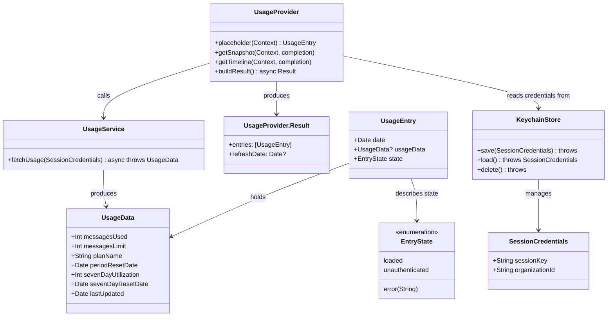

# MacOS WidgetKit Widget for Claude Usage Metrics

## Requirements
Implement a macOS WidgetKit widget that displays Claude AI usage metrics sourced from the authenticated user's claude.ai account, enabling at-a-glance monitoring of message usage, limits, and plan status directly from the macOS Desktop or Notification Center. The solution comprises a WidgetKit App Extension and a minimal companion host app for credential management.

## Entities

## Approach

1. Widget Architecture:
   - Implement as a macOS App Extension (WidgetExtension target) within a host app Xcode project
   - Use WidgetKit `TimelineProvider` protocol for scheduled data refresh every 30 minutes
   - Host app manages credential entry; widget extension reads from shared Keychain access group
   - Shared code (models, service, keychain) compiled into both targets via shared Swift source files

2. Authentication Strategy:
   - Session token (cookie) extracted manually from the user's browser on claude.ai
   - Stored in a shared Keychain access group accessible by both the host app and widget extension
   - Host companion app provides a `SecureField` for token entry; no OAuth flow required for MVP
   - Token never written to UserDefaults, App Group files, or logs

3. Data Fetching:
   - `UsageService` makes authenticated HTTPS requests to the claude.ai internal usage API endpoint (identified by inspecting network traffic on `https://claude.ai/settings/usage`)
   - The API returns utilization percentages (0–100) for named time windows (`five_hour`, `seven_day`), not raw message counts; each bucket has a `utilization: Double` and `resets_at: String?` field
   - `resets_at` uses ISO 8601 with fractional seconds (e.g. `2026-05-25T10:00:01.174634+00:00`); date parsing must try `.withFractionalSeconds` before falling back to standard format
   - JSON response parsed via `Codable` using two internal types: `UsageBucket` (single time-window entry) and `UsageAPIResponse` (top-level container with `fiveHour` and `sevenDay` buckets)
   - `UsageBucket` and `UsageAPIResponse` are `internal` (not `private`) to allow direct testing without host-app imports
   - `UsageAPIResponse.toUsageData()` maps utilization percentage to `messagesUsed` (Int, rounded) with `messagesLimit` fixed at 100; `planName` is always "Pro" as the API does not return plan information
   - Last successful `UsageData` cached as JSON in the shared App Group container so the widget shows stale-but-labelled data on network failure
   - `URLSession` with a 15-second timeout; no persistent background tasks in the extension

4. Display Strategy:
   - SwiftUI views for `.systemSmall` and `.systemMedium` widget families
   - Small: circular progress arc (5-hour utilization %), plan badge, time-to-reset countdown (hours/minutes/days)
   - Medium: left column is `SmallWidgetView`; right column shows 7-day utilization progress bar with its own reset countdown and last-updated timestamp
   - Distinct placeholder views for unauthenticated and error states with actionable copy
   - All widget views apply `.containerBackground(for: .widget) { Color.clear }` as required by WidgetKit on macOS 14+

## Structure

### Inheritance Relationships
1. `TimelineProvider` protocol defines `placeholder`, `getSnapshot`, `getTimeline` contract
2. `UsageProvider` implements `TimelineProvider`
3. `TimelineEntry` protocol requires `date: Date`
4. `UsageEntry` implements `TimelineEntry`
5. `Widget` protocol (SwiftUI) defines the widget entry point
6. `ClaudeUsageWidget` implements `Widget`

### Dependencies
1. `UsageProvider` depends on `UsageService` (data fetching) and `KeychainStore` (credential access)
2. `ClaudeUsageWidget` declares `UsageProvider` as its `TimelineProvider`
3. `WidgetEntryView` receives `UsageEntry`; dispatches on `entry.state` first, then `widgetFamily`; passes `UsageData` directly to content views; applies `.containerBackground(for: .widget) { Color.clear }` to its root view
4. `SmallWidgetView` and `MediumWidgetView` accept `usage: UsageData` (not `UsageEntry`) — state handling is the responsibility of `WidgetEntryView`
5. `MediumWidgetView` owns a private `SevenDayRowView(usage: UsageData)` displaying 7-day utilization — not a top-level component
6. Host app `SettingsView` writes `SessionCredentials` via `KeychainStore` and calls `WidgetCenter.shared.reloadAllTimelines()`

### Layered Architecture
1. Widget Presentation Layer: `WidgetEntryView`, `SmallWidgetView`, `MediumWidgetView`, `UnauthenticatedView`, `ErrorView` — pure SwiftUI rendering of `UsageEntry`
2. Provider Layer: `UsageProvider` — orchestrates timeline lifecycle, error handling, and caching
3. Service Layer: `UsageService` — owns all network I/O and JSON parsing
4. Storage Layer: `KeychainStore` (credentials), `UsageCache` (App Group JSON cache) — abstracts persistence
5. Host App Layer: `SettingsView` — credential management UI; no business logic

## Operations

### Create Xcode Project Structure
1. Responsibility: Set up the multi-target Xcode project using XcodeGen (`project.yml`)
2. Targets:
   - `ClaudeUsageWidgetApp` — macOS SwiftUI host app (macOS 26.0+)
   - `ClaudeUsageWidgetExtension` — WidgetKit App Extension
   - `ClaudeUsageWidgetTests` — unit test bundle; sources include `ClaudeUsageWidgetTests/`, `ClaudeUsageWidget/Shared/`, and `ClaudeUsageWidget/Widget/Provider/`; depends on `WidgetKit.framework`; build settings: `CODE_SIGN_IDENTITY=""`, `CODE_SIGNING_REQUIRED=NO`, `CODE_SIGNING_ALLOWED=NO` (required for CI environments without signing certificates)
3. Entitlements for app and extension targets:
   - App Groups: `group.com.yourorg.claudeusagewidget`
   - Keychain Sharing: `com.yourorg.claudeusagewidget`
4. Shared source files added to both app and extension targets: `UsageData.swift`, `SessionCredentials.swift`, `KeychainStore.swift`, `UsageService.swift`, `UsageCache.swift`, `UsageEntry.swift`, `EntryState.swift`

### Create Model — UsageData
1. Responsibility: Value type for a Claude usage snapshot
2. Attributes:
   - `messagesUsed`: Int — 5-hour utilization percentage (0–100), rounded from API `utilization` Double
   - `messagesLimit`: Int — always 100 (utilization is a percentage; no raw count available from API)
   - `planName`: String — always "Pro" (API does not return plan information)
   - `periodResetDate`: Date — when the 5-hour usage window resets (from `five_hour.resets_at`)
   - `sevenDayUtilization`: Int — 7-day utilization percentage (0–100), rounded
   - `sevenDayResetDate`: Date — when the 7-day usage window resets (from `seven_day.resets_at`)
   - `lastUpdated`: Date — when this snapshot was fetched
3. Conformances: `Codable`, `Equatable`
4. Static factory: `static func placeholder() -> UsageData` returning representative dummy values for widget previews
5. Coding helpers (extensions co-located in `UsageData.swift`, shared between both targets):
   - `JSONDecoder.usageDecoder` — `keyDecodingStrategy: .convertFromSnakeCase`, `dateDecodingStrategy: .iso8601`; used by `UsageService` to parse API responses and by `UsageCache` to read the cache
   - `JSONEncoder.usageEncoder` — `dateEncodingStrategy: .iso8601`; used by `UsageCache` to write the cache

### Create Model — UsageEntry
1. Responsibility: WidgetKit timeline entry wrapping usage state
2. Attributes:
   - `date`: Date — required by `TimelineEntry`
   - `usageData`: UsageData? — nil when not in `.loaded` state
   - `state`: EntryState — describes why data may be absent
3. Conformances: `TimelineEntry`
4. Static factories:
   - `static func placeholder() -> UsageEntry`
   - `static func unauthenticated() -> UsageEntry`
   - `static func error(_ message: String) -> UsageEntry`

### Create Enum — EntryState
1. Cases:
   - `.loaded` — `usageData` is populated
   - `.unauthenticated` — no credentials found in Keychain
   - `.error(String)` — fetch or decode failed; associated string is display-safe message
2. Conformances: `Equatable`

### Create — SessionCredentials
1. Responsibility: Credential value type stored in Keychain
2. Attributes:
   - `sessionKey`: String — value of the `sessionKey` cookie from claude.ai
   - `organizationId`: String — optional org UUID (empty string if personal account)
3. Conformances: `Codable`

### Create — KeychainStore
1. Responsibility: Read/write `SessionCredentials` in the shared Keychain access group
2. Constants:
   - `service`: `"com.yourorg.claudeusagewidget.session"`
   - `accessGroup`: `"com.yourorg.claudeusagewidget"` (matches entitlement)
3. Methods:
   - `func save(_ credentials: SessionCredentials) throws`
     - Logic: JSON-encode credentials; call `SecItemAdd` or `SecItemUpdate` for the access group
   - `func load() throws -> SessionCredentials`
     - Logic: `SecItemCopyMatching` with `kSecReturnData`; JSON-decode; throw `KeychainError.notFound` if absent
   - `func delete() throws`
     - Logic: `SecItemDelete` for the service/access group key
4. Error type: `KeychainError` enum — `.notFound`, `.unexpectedData`, `.unhandledError(OSStatus)`

### Create — UsageCache
1. Responsibility: Persist last-successful `UsageData` in shared App Group container for stale display on network failure
2. File path: `FileManager.default.containerURL(forSecurityApplicationGroupIdentifier: appGroupID)!.appendingPathComponent("usage_cache.json")`
3. Methods:
   - `func save(_ data: UsageData) throws` — JSON-encode and write atomically
   - `func load() -> UsageData?` — read and decode; return nil on missing/corrupt file

### Create — UsageService
1. Responsibility: Authenticated HTTP fetch and parse of Claude usage data
2. Properties:
   - `session`: URLSession — configured with 15-second timeout
3. Method: `func fetchUsage(credentials: SessionCredentials) async throws -> UsageData`
   - Logic:
     1. Build URL: `https://claude.ai/api/usage` for personal accounts, or `https://claude.ai/api/organizations/<organizationId>/usage` when `organizationId` is non-empty
     2. Set request headers: `Cookie: sessionKey=<value>`, `User-Agent: ClaudeUsageWidget/1.0 macOS`, `Accept: application/json`
     3. Perform `URLSession.data(for:)` with 15s timeout
     4. Check HTTP status: throw `UsageServiceError.unauthenticated` on 401/403
     5. Decode response via `JSONDecoder.usageDecoder` into `UsageAPIResponse`
     6. Call `UsageAPIResponse.toUsageData()` and return
4. Internal types (not `private`; must be accessible to the test target which compiles the Shared sources directly):
   - `UsageBucket`: Codable struct with `utilization: Double?` and `resetsAt: String?`
   - `UsageAPIResponse`: Codable struct with `fiveHour: UsageBucket?` and `sevenDay: UsageBucket?`; unknown top-level API keys (e.g. `tangelo`, `iguana_necktie`) are silently ignored by the synthesised decoder
   - `UsageAPIResponse.toUsageData()` internal method: maps `fiveHour.utilization` → `messagesUsed` (rounded Int), `sevenDay.utilization` → `sevenDayUtilization`, parses `resets_at` strings manually using `ISO8601DateFormatter` trying `.withFractionalSeconds` first then standard format; falls back to `now + 5h` / `now + 7d` when the field is nil or unparseable; `planName` is always "Pro"
   - `UsageAPIResponse.parseDate(_ string: String?) -> Date?` private helper: creates `ISO8601DateFormatter` with `[.withInternetDateTime, .withFractionalSeconds]`; on failure retries with `[.withInternetDateTime]`
5. Error type: `UsageServiceError` enum — `.unauthenticated`, `.networkError(Error)`, `.decodingError(Error)`, `.unexpectedResponse(Int)`

### Create — UsageProvider (TimelineProvider)
1. Responsibility: Supply WidgetKit with `UsageEntry` instances on a 30-minute refresh schedule
2. Dependencies: `UsageService`, `KeychainStore`, `UsageCache`
3. Nested type `Result`:
   - `entries: [UsageEntry]` — entries for the timeline
   - `refreshDate: Date?` — when to schedule the next reload; `nil` maps to `.never` policy (`TimelineReloadPolicy` is a struct with no accessible stored properties and cannot be pattern-matched, so the date is carried separately)
4. Methods:
   - `func placeholder(in context: Context) -> UsageEntry`
     - Return: `UsageEntry` built from `UsageData.placeholder()`
   - `func getSnapshot(in context: Context, completion: @escaping (UsageEntry) -> Void)`
     - Logic: return `UsageCache.load()` if available, otherwise placeholder
   - `func getTimeline(in context: Context, completion: @escaping (Timeline<UsageEntry>) -> Void)`
     - Logic: call `await buildResult()`; convert `Result.refreshDate` to `TimelineReloadPolicy` (`.after(date)` when non-nil, `.never` when nil); call `completion(Timeline(entries:policy:))`
   - `func buildResult() async -> Result`
     - Logic:
       1. Load credentials from `KeychainStore`; if `.notFound` → return `Result(entries: [.unauthenticated()], refreshDate: nil)`
       2. `await UsageService.fetchUsage(credentials:)`; on success: save to `UsageCache`, create `.loaded` entry
       3. If `usage.periodResetDate < Date()` set `refreshDate` to `Date().addingTimeInterval(RefreshPolicy.postResetInterval)` (5-min fast-path); otherwise use `RefreshPolicy.refreshInterval` (30 min)
       4. On `UsageServiceError.unauthenticated`: return `Result(entries: [.unauthenticated()], refreshDate: nil)`
       5. On `UsageServiceError.rateLimited(retryAfter)`: use `retryAfter ?? RefreshPolicy.rateLimitedFallback` as delay; return cached entry if available, else `.error("Rate limited. Retrying soon.")`; `refreshDate` is the computed retry date
       6. On other error: load stale `UsageCache`; if available return `.loaded` entry with `refreshDate = nextRefresh`; else return `.error("Couldn't reach claude.ai")` with `refreshDate = nextRefresh`
     - Note: `TimelineProviderContext` has no public initializer and cannot be constructed in tests; all timeline logic lives in `buildResult()` which takes no WidgetKit protocol arguments and is directly callable from unit tests

### Create SwiftUI Widget Views
1. `WidgetEntryView` — root view with two-level dispatch
   - Extracts state dispatch into a `@ViewBuilder var widgetContent` computed property to allow attaching `.containerBackground(for: .widget) { Color.clear }` to the root `body`
   - `widgetContent` dispatches on `entry.state`:
     - `.unauthenticated` → `UnauthenticatedView()` (short-circuit, no family check)
     - `.error(message)` → `ErrorView(message:)` (short-circuit, no family check)
     - `.loaded` → unwrap `entry.usageData`; if nil fall back to `ErrorView("No data available")`
   - Then dispatches on `@Environment(\.widgetFamily)`:
     - `.systemMedium` → `MediumWidgetView(usage:)`
     - default → `SmallWidgetView(usage:)` (covers `.systemSmall` and any future families)

2. `SmallWidgetView(usage: UsageData)` — `.systemSmall`
   - Layout: VStack with circular progress arc (shape-based), usage fraction text (e.g. "21/100"), plan badge, time-to-reset label
   - If `messagesLimit == 0`: show "Unlimited" SF Symbol (`infinity`) + used-count text in place of progress arc
   - `isStale: Bool` computed property — `true` when `Date().timeIntervalSince(usage.lastUpdated) > 1800`
   - `staleLabel` view — `Text("Stale data")` in `.tertiary` style; shown below plan badge when `isStale`
   - Arc colour: `.tint` below 70 % usage, `.orange` 70–90 %, `.red` above 90 %; implemented via `AnyShapeStyle` wrapper (required because `.tint` is a `ShapeStyle`, not a `Color`, and cannot be used in `Canvas` drawing contexts)
   - Progress arc drawn using a custom `ArcShape: Shape` struct (not `Canvas`); `ArcShape` takes a `fraction: Double` and draws via `path.addArc` from `-90°` to `-90° + 360° × fraction`
   - `timeUntilReset: String` computed property: if `periodResetDate > now`, inspects day/hour/minute components — returns "Resets in Xd" when days > 0, "Resets in Xh" when hours > 0, otherwise "Resets in Xm" (minimum 1); returns "Resetting…" when date is in the past

3. `MediumWidgetView(usage: UsageData)` — `.systemMedium`
   - Layout: HStack — left column is `SmallWidgetView(usage:)` (showing 5-hour window); right column contains `SevenDayRowView(usage:)` and a last-updated label
   - Private `SevenDayRowView(usage: UsageData)` struct:
     - Header row: `HStack` with "7-day" label (`.primary`) and `"\(sevenDayUtilization)%"` value (`.primary`, monospaced digit)
     - `Capsule` progress bar proportional to `sevenDayUtilization / 100`; `.tint` fill
     - Reset countdown label using same day/hour logic as `SmallWidgetView.timeUntilReset` (applied to `sevenDayResetDate`)

4. `UnauthenticatedView` — state: `.unauthenticated`
   - Text: "Open Claude Widget\nto sign in"
   - Icon: SF Symbol `person.crop.circle.badge.exclamationmark`

5. `ErrorView(message: String)` — state: `.error`
   - Text: error message (truncated to 2 lines)
   - Icon: SF Symbol `exclamationmark.triangle`
   - Deep-link label: "Tap to retry" — links to host app via custom URL scheme

### Create Install Script (`install.sh`)
1. Responsibility: Automate building and installing the app locally for end users
2. Prerequisites check: verify `xcodegen` is on `$PATH` (error with install hint if missing); verify Xcode CLI tools via `xcode-select -p`
3. Steps:
   1. Run `xcodegen generate --quiet`
   2. Run `xcodebuild build` into a temp directory (cleaned up via `trap`); scheme `ClaudeUsageWidgetApp`, configuration Debug
   3. Find the built `.app` bundle under the derived data temp dir
   4. Copy to `/Applications/`, removing any prior installation
   5. Clear quarantine: `xattr -dr com.apple.quarantine /Applications/ClaudeUsageWidgetApp.app`
   6. Register widget extension: `pluginkit -e use -i io.github.sergei-matheson.claudeusagewidget.extension`
4. Executable: `chmod +x install.sh`; run from repo root with `./install.sh`

### Create Test Script (`test.sh`)
1. Responsibility: Convenience wrapper around `xcodegen generate` + `xcodebuild test` for local and CI use
2. Steps:
   1. Run `xcodegen generate --quiet`
   2. Run `xcodebuild test -project ClaudeUsageWidget.xcodeproj -scheme ClaudeUsageWidgetTests -destination 'platform=macOS'`; pipe output through `xcbeautify` for readable formatting
3. Optional argument: if `$1` is provided, pass as `-only-testing:"$1"` to run a single test class or method (e.g. `./test.sh ClaudeUsageWidgetTests/UsageServiceTests/testParsesUtilizationValues`)
4. Executable: `chmod +x test.sh`; run from repo root with `./test.sh`

### Create CI Pipeline (`.github/workflows/ci.yml`)
1. Responsibility: Run the test suite automatically on every push to `main` and on every pull request
2. Triggers: `push` to `main`; `pull_request` (all branches)
3. Runner: `macos-26` (matches deployment target)
4. Steps:
   1. `actions/checkout@v6`
   2. Install `xcodegen` and `xcbeautify` via Homebrew
   3. Run `./test.sh`
5. The test target's code signing is disabled in `project.yml` so no signing certificate is required on the runner

### Create ClaudeUsageWidget (Widget Entry Point)
1. Responsibility: Widget bundle declaration
2. Declare `@main struct ClaudeUsageWidget: Widget` with `kind = "ClaudeUsageWidget"`, `StaticConfiguration` using `UsageProvider`, `WidgetEntryView`, display name "Claude Usage", and `supportedFamilies([.systemSmall, .systemMedium])`

### Create Host App — SettingsView
1. Responsibility: Allow the user to enter and persist their claude.ai session token
2. State:
   - `@State var sessionToken: String`
   - `@State var organizationId: String`
   - `@State var statusMessage: String`
3. UI:
   - `SecureField("Session token", text: $sessionToken)` with paste affordance
   - `TextField("Organization ID (optional)", text: $organizationId)`
   - Save button:
     1. Validate `sessionToken` non-empty
     2. Call `KeychainStore().save(SessionCredentials(sessionKey: sessionToken, organizationId: organizationId))`
     3. Call `WidgetCenter.shared.reloadAllTimelines()`
     4. Set `statusMessage = "Saved. Widget will refresh shortly."`
   - Clear button: `KeychainStore().delete()` + `WidgetCenter.shared.reloadAllTimelines()`
4. Supplementary text explaining how to obtain the session token from browser DevTools

### Create Unit Tests
1. Responsibility: Verify JSON parsing, HTTP behaviour, and timeline logic
2. Target: `ClaudeUsageWidgetTests` — unit test bundle that compiles `ClaudeUsageWidget/Shared/`, `ClaudeUsageWidget/Widget/Provider/` source files directly (no `@testable import`; shared types are accessible within the same compilation unit); imports `WidgetKit` for `UsageProvider.Result` and `UsageEntry`
3. Test class: `UsageServiceTests: XCTestCase`
4. Test cases for `UsageServiceTests`:
   - `testParsesUtilizationValues` — decode full response JSON matching the real API shape; assert `messagesUsed == 15`, `messagesLimit == 100`, `sevenDayUtilization == 2`
   - `testRoundsUtilizationToNearestInt` — decode JSON with fractional utilization values (e.g. 15.6, 2.4); assert correct rounding
   - `testParsesFractionalSecondsResetDate` — verify that `resets_at` strings with fractional seconds (e.g. `"2026-05-25T10:00:01.174634+00:00"`) produce the correct `periodResetDate` rather than falling back to the default
   - `testFallsBackWhenFiveHourMissing` — decode JSON with no `five_hour` key; assert `messagesUsed == 0` and `periodResetDate ≈ now + 5h`
   - `testFallsBackWhenResetDateIsNull` — decode JSON where `resets_at` is null in both buckets; assert both reset dates fall back to appropriate defaults
   - `testIgnoresUnknownTopLevelKeys` — decode JSON containing unknown keys (`tangelo`, `iguana_necktie`); assert no decode error is thrown
   - `testPlanNameIsPro` — assert `planName == "Pro"` regardless of response content
5. Test class: `UsageServiceHTTPTests: XCTestCase` — uses `StubURLProtocol` to intercept `URLSession` requests; verifies HTTP-level behaviour of `UsageService`
6. Test cases for `UsageServiceHTTPTests`:
   - `testReturnsUsageOn200` — stub 200 with valid JSON; assert decoded utilization
   - `testThrowsUnauthenticatedOn401` / `testThrowsUnauthenticatedOn403` — assert `UsageServiceError.unauthenticated`
   - `testThrowsRateLimitedOn429` — assert `UsageServiceError.rateLimited(nil)` when no `Retry-After` header
   - `testHonorsRetryAfterHeaderOn429` — assert `retryAfter == 120` when `Retry-After: 120`
   - `testIgnoresInvalidRetryAfterHeader` — assert `retryAfter == nil` for HTTP-date form of `Retry-After`
   - `testThrowsUnexpectedOn500` — assert `UsageServiceError.unexpectedResponse(500)`
   - `testThrowsDecodingErrorOnMalformedBody` — stub valid 200 with non-JSON body; assert `UsageServiceError.decodingError`
   - `testSendsCookieHeader` — assert `Cookie: sessionKey=<value>` header is present
   - `testRejectsInvalidOrganizationId` — assert `UsageServiceError.invalidOrganizationId` for path-traversal org ID
   - `testWrapsNetworkErrors` — stub `URLError(.timedOut)`; assert `UsageServiceError.networkError`
   - `testSendsUserAgentHeader` — assert `User-Agent: ClaudeUsageWidget/1.0 macOS`
7. Test class: `UsageProviderTests: XCTestCase` — tests `UsageProvider.buildResult()` end-to-end using a real `KeychainStore` (unique service name per test), real `UsageCache` (temp file), and `StubURLProtocol`; verifies `Result.entries` and `Result.refreshDate` directly (avoids `TimelineProviderContext` and `TimelineReloadPolicy` WidgetKit types)
8. Test cases for `UsageProviderTests`:
   - `testUnauthenticatedWhenCredentialsMissing` — no keychain entry; assert `entries.first?.state == .unauthenticated` and `refreshDate == nil`
   - `testSuccessReturnsLoadedEntry` — valid credentials + 200 stub; assert `.loaded`, correct utilization values
   - `testRateLimitedWithRetryAfterSchedulesRetry` — 429 with `Retry-After: 120`; assert `.error("Rate limited. Retrying soon.")` and `refreshDate ≈ now + 120s`
   - `testRateLimitedWithoutRetryAfterUsesFallbackAndCache` — 429 no header + pre-seeded cache; assert `.loaded` stale data and `refreshDate ≈ now + RefreshPolicy.rateLimitedFallback`
   - `testNetworkErrorFallsBackToCache` — `URLError(.timedOut)` + pre-seeded cache; assert `.loaded` cached data

## Norms
1. Language & Frameworks: Swift 5.9+, SwiftUI, WidgetKit; macOS 26.0+ deployment target; zero third-party dependencies
2. App Groups: All shared persistent data uses files in the App Group container; never `UserDefaults.standard` in the extension
3. Keychain: Session credentials stored exclusively in the shared Keychain access group; `kSecAttrAccessible` set to `kSecAttrAccessibleAfterFirstUnlock` so the extension can read it
4. Network: All requests via `URLSession`; 15-second request timeout; no persistent background tasks or `URLSession` background configuration in the extension
5. Error Handling: All error paths in `getTimeline` must produce a valid `UsageEntry`; no unhandled throws; widget must never crash regardless of network or credential state
6. Refresh Policy: `Timeline` refresh policy minimum 30 minutes; do not use `.atEnd` unless there is a known hard expiry
7. Privacy: Session tokens never appear in `print`, `os_log`, crash reports, or `NSError` userInfo; redact with `<redacted>` if debug logging is added
8. Widget Previews: All `View` types include a `#Preview` macro block using `UsageData.placeholder()` sample data; widget entry views use `#Preview(as: .systemSmall/systemMedium)` with `ClaudeUsageWidget()` + a `timeline` block
9. Shared Source Files: Files shared between app and extension targets use no `#if` target guards; they must compile cleanly in both contexts
10. Comments: Only for non-obvious constraints (e.g. WidgetKit network budget, Keychain access group requirements, undocumented API endpoints)
11. JSON Coding: Use `JSONDecoder.usageDecoder` and `JSONEncoder.usageEncoder` (defined as static extensions in `UsageData.swift`) for all domain model serialisation; never instantiate standalone decoders/encoders inline for domain types
12. Widget Background: All widget entry views must apply `.containerBackground(for: .widget) { Color.clear }` at the root body level; this is required by WidgetKit on macOS 14+ and must not be omitted
13. Testability: Internal types that are logic-bearing and shared across the `ClaudeUsageWidget/Shared/` folder should be declared `internal` (not `private`) when they need to be accessed by the test target; `private` is acceptable only for file-local implementation details that carry no independent logic
14. WidgetKit Testability: Extract all async timeline-building logic from `TimelineProvider` protocol methods into an internal method (e.g. `buildResult() async -> Result`) that takes no WidgetKit protocol arguments; `TimelineProviderContext` has no public initializer and cannot be constructed in tests; `TimelineReloadPolicy` is a struct with no accessible stored properties and cannot be pattern-matched — carry refresh dates as `Date?` in a plain result type instead

## Safeguards
1. Functional Constraints:
   - Widget must display usage data without the host app being open or running
   - Widget must show `UnauthenticatedView` (not blank or crashed) when no credentials are stored
   - Widget must show stale cached data with a visible "last updated" timestamp rather than an error when the network request fails but cache exists
   - All three widget states (loaded, unauthenticated, error) must be reachable and visually distinct
2. Performance Constraints:
   - Network request in `getTimeline` must complete within 15 seconds; cancel and return cached/error state beyond that
   - Timeline refresh no more frequently than every 30 minutes (WidgetKit enforces this but the provider must also not request shorter intervals)
   - SwiftUI view rendering must not perform blocking I/O or network calls
3. Security Constraints:
   - Session token stored exclusively in shared Keychain (`kSecClassGenericPassword`) — never in UserDefaults, App Group files, or NSUserActivity
   - No session token in `os_log`, crash reporters, or error descriptions surfaced to the UI
   - App Group container stores only non-sensitive cached `UsageData` JSON
4. Integration Constraints:
   - Both targets must declare matching App Group and Keychain Sharing entitlements; build will fail at runtime otherwise
   - macOS 26.0+ required; enforce via `MACOSX_DEPLOYMENT_TARGET`
   - The `organizationId` field is optional; if empty the service must handle personal accounts (no org in the API path)
5. Business Rule Constraints:
   - If `messagesLimit == 0`, display "Unlimited" and omit the progress arc
   - If `periodResetDate` is in the past, show "Resetting…" instead of a countdown and trigger a timeline reload
   - Widget must distinguish `.unauthenticated` (no credentials) from `.error` (credentials present but fetch failed)
6. API Constraints:
   - The claude.ai usage API returns utilization percentages (0–100) for named time windows; it does not return raw message counts, per-model breakdowns, or plan names
   - The API response contains known top-level keys (`five_hour`, `seven_day`) and undocumented keys that must be silently ignored; `UsageAPIResponse` must declare only the fields it uses
   - `resets_at` timestamps use ISO 8601 with fractional seconds; parsing must use `ISO8601DateFormatter` with `.withFractionalSeconds` option, not the standard `.iso8601` `DateDecodingStrategy` (which does not support fractional seconds)
   - `User-Agent` header must identify the widget: `ClaudeUsageWidget/1.0 macOS`
   - Handle HTTP 429 (rate limit) by extending next refresh to 60 minutes and returning cached data
7. Data Constraints:
   - `UsageData` must be `Codable` for App Group JSON caching
   - Cache file written atomically using `Data.write(to:options:.atomic)` to prevent corrupt reads
   - Cache older than 24 hours treated as expired; display stale warning label
8. Xcode Project Constraints:
   - Shared Swift files added to both app and extension targets via "Target Membership" — no framework target required for MVP
   - Minimum Xcode version: 16.0 (for macOS 26 SDK with latest WidgetKit APIs)
   - Bundle ID of extension must be prefixed with the host app's bundle ID (e.g. `com.yourorg.claudeusagewidget.extension`)
   - Test target (`ClaudeUsageWidgetTests`) compiles Shared sources and `Widget/Provider/` directly; it must not be set as the extension's test host
   - Test target must set `CODE_SIGN_IDENTITY=""`, `CODE_SIGNING_REQUIRED=NO`, `CODE_SIGNING_ALLOWED=NO` so tests run in CI environments that have no signing certificate; unit test bundles do not require signing
9. CI Constraints:
   - The CI pipeline must run on a runner whose macOS version matches the deployment target (currently `macos-26`)
   - `xcbeautify` must be installed alongside `xcodegen` on the CI runner; `test.sh` pipes `xcodebuild` output through it
   - No secrets or signing credentials are required for the test pipeline; the code-signing build settings on the test target are sufficient
