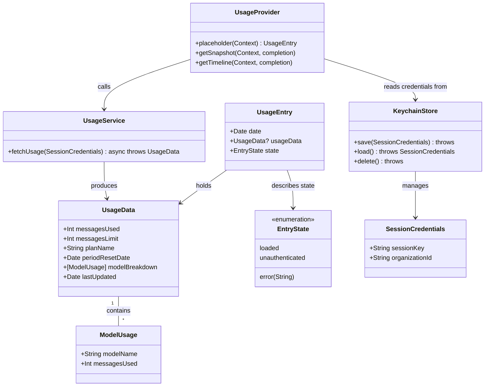

# MacOS WidgetKit Widget for Claude Usage Metrics

## Requirements
Implement a macOS WidgetKit widget that displays Claude AI usage metrics sourced from the authenticated user's claude.ai account, enabling at-a-glance monitoring of message usage, limits, and plan status directly from the macOS Desktop or Notification Center. The solution comprises a WidgetKit App Extension and a minimal companion host app for credential management.

## Entities


## Approach

1. Widget Architecture:
   - Implement as a macOS App Extension (WidgetExtension target) within a host app Xcode project
   - Use WidgetKit `TimelineProvider` protocol for scheduled data refresh every 30 minutes
   - Host app manages credential entry; widget extension reads from shared Keychain access group
   - Shared code (models, service, keychain) compiled into both targets via shared Swift source files

2. Authentication Strategy:
   - Session token (cookie) extracted manually from the user's browser on claude.ai
   - Stored in a shared Keychain access group accessible by both the host app and widget extension
   - Host companion app provides a `SecureField` for token entry; no OAuth flow required for MVP
   - Token never written to UserDefaults, App Group files, or logs

3. Data Fetching:
   - `UsageService` makes authenticated HTTPS requests to the claude.ai internal usage API endpoint (identified by inspecting network traffic on `https://claude.ai/settings/usage`)
   - JSON response parsed into `UsageData` via `Codable`; intermediate `UsageAPIResponse` type absorbs API schema changes gracefully using optional fields
   - Last successful `UsageData` cached as JSON in the shared App Group container so the widget shows stale-but-labelled data on network failure
   - `URLSession` with a 15-second timeout; no persistent background tasks in the extension

4. Display Strategy:
   - SwiftUI views for `.systemSmall` and `.systemMedium` widget families
   - Small: circular progress arc (messages used / limit), plan badge, days-to-reset countdown
   - Medium: same as small plus per-model breakdown list (up to 3 rows) and last-updated timestamp
   - Distinct placeholder views for unauthenticated and error states with actionable copy

## Structure

### Inheritance Relationships
1. `TimelineProvider` protocol defines `placeholder`, `getSnapshot`, `getTimeline` contract
2. `UsageProvider` implements `TimelineProvider`
3. `TimelineEntry` protocol requires `date: Date`
4. `UsageEntry` implements `TimelineEntry`
5. `Widget` protocol (SwiftUI) defines the widget entry point
6. `ClaudeUsageWidget` implements `Widget`

### Dependencies
1. `UsageProvider` depends on `UsageService` (data fetching) and `KeychainStore` (credential access)
2. `ClaudeUsageWidget` declares `UsageProvider` as its `TimelineProvider`
3. `WidgetEntryView` receives `UsageEntry`; dispatches on `entry.state` first, then `widgetFamily`; passes `UsageData` directly to content views
4. `SmallWidgetView` and `MediumWidgetView` accept `usage: UsageData` (not `UsageEntry`) — state handling is the responsibility of `WidgetEntryView`
5. `MediumWidgetView` owns a private `ModelRowView(model: ModelUsage, limit: Int)` — not a top-level component
5. Host app `SettingsView` writes `SessionCredentials` via `KeychainStore` and calls `WidgetCenter.shared.reloadAllTimelines()`

### Layered Architecture
1. Widget Presentation Layer: `WidgetEntryView`, `SmallWidgetView`, `MediumWidgetView`, `UnauthenticatedView`, `ErrorView` — pure SwiftUI rendering of `UsageEntry`
2. Provider Layer: `UsageProvider` — orchestrates timeline lifecycle, error handling, and caching
3. Service Layer: `UsageService` — owns all network I/O and JSON parsing
4. Storage Layer: `KeychainStore` (credentials), `UsageCache` (App Group JSON cache) — abstracts persistence
5. Host App Layer: `SettingsView` — credential management UI; no business logic

## Operations

### Create Xcode Project Structure
1. Responsibility: Set up the multi-target Xcode project
2. Targets:
   - `ClaudeUsageWidgetApp` — macOS SwiftUI host app (macOS 26.0+)
   - `ClaudeUsageWidgetExtension` — WidgetKit App Extension
3. Entitlements for both targets:
   - App Groups: `group.com.yourorg.claudeusagewidget`
   - Keychain Sharing: `com.yourorg.claudeusagewidget`
4. Shared source files added to both targets: `UsageData.swift`, `ModelUsage.swift`, `SessionCredentials.swift`, `KeychainStore.swift`, `UsageService.swift`, `UsageCache.swift`

### Create Model — UsageData
1. Responsibility: Value type for a Claude usage snapshot
2. Attributes:
   - `messagesUsed`: Int — messages consumed in current billing period
   - `messagesLimit`: Int — plan message cap (0 = unlimited)
   - `planName`: String — e.g. "Pro", "Team", "Free"
   - `periodResetDate`: Date — when the usage counter resets
   - `modelBreakdown`: [ModelUsage] — per-model counts; may be empty
   - `lastUpdated`: Date — when this snapshot was fetched
3. Conformances: `Codable`, `Equatable`
4. Static factory: `static func placeholder() -> UsageData` returning representative dummy values for widget previews
5. Coding helpers (extensions co-located in `UsageData.swift`, shared between both targets):
   - `JSONDecoder.usageDecoder` — `keyDecodingStrategy: .convertFromSnakeCase`, `dateDecodingStrategy: .iso8601`; used by `UsageService` to parse API responses and by `UsageCache` to read the cache
   - `JSONEncoder.usageEncoder` — `dateEncodingStrategy: .iso8601`; used by `UsageCache` to write the cache

### Create Model — ModelUsage
1. Responsibility: Per-model usage breakdown entry
2. Attributes:
   - `modelName`: String — e.g. "claude-opus-4-7", "claude-sonnet-4-6"
   - `messagesUsed`: Int
3. Conformances: `Codable`, `Equatable`

### Create Model — UsageEntry
1. Responsibility: WidgetKit timeline entry wrapping usage state
2. Attributes:
   - `date`: Date — required by `TimelineEntry`
   - `usageData`: UsageData? — nil when not in `.loaded` state
   - `state`: EntryState — describes why data may be absent
3. Conformances: `TimelineEntry`
4. Static factories:
   - `static func placeholder() -> UsageEntry`
   - `static func unauthenticated() -> UsageEntry`
   - `static func error(_ message: String) -> UsageEntry`

### Create Enum — EntryState
1. Cases:
   - `.loaded` — `usageData` is populated
   - `.unauthenticated` — no credentials found in Keychain
   - `.error(String)` — fetch or decode failed; associated string is display-safe message
2. Conformances: `Equatable`

### Create — SessionCredentials
1. Responsibility: Credential value type stored in Keychain
2. Attributes:
   - `sessionKey`: String — value of the `sessionKey` cookie from claude.ai
   - `organizationId`: String — optional org UUID (empty string if personal account)
3. Conformances: `Codable`

### Create — KeychainStore
1. Responsibility: Read/write `SessionCredentials` in the shared Keychain access group
2. Constants:
   - `service`: `"com.yourorg.claudeusagewidget.session"`
   - `accessGroup`: `"com.yourorg.claudeusagewidget"` (matches entitlement)
3. Methods:
   - `func save(_ credentials: SessionCredentials) throws`
     - Logic: JSON-encode credentials; call `SecItemAdd` or `SecItemUpdate` for the access group
   - `func load() throws -> SessionCredentials`
     - Logic: `SecItemCopyMatching` with `kSecReturnData`; JSON-decode; throw `KeychainError.notFound` if absent
   - `func delete() throws`
     - Logic: `SecItemDelete` for the service/access group key
4. Error type: `KeychainError` enum — `.notFound`, `.unexpectedData`, `.unhandledError(OSStatus)`

### Create — UsageCache
1. Responsibility: Persist last-successful `UsageData` in shared App Group container for stale display on network failure
2. File path: `FileManager.default.containerURL(forSecurityApplicationGroupIdentifier: appGroupID)!.appendingPathComponent("usage_cache.json")`
3. Methods:
   - `func save(_ data: UsageData) throws` — JSON-encode and write atomically
   - `func load() -> UsageData?` — read and decode; return nil on missing/corrupt file

### Create — UsageService
1. Responsibility: Authenticated HTTP fetch and parse of Claude usage data
2. Properties:
   - `session`: URLSession — configured with 15-second timeout
3. Method: `func fetchUsage(credentials: SessionCredentials) async throws -> UsageData`
   - Logic:
     1. Build URL: `https://claude.ai/api/organizations/<organizationId>/usage` or the endpoint observed in browser network inspector on the usage settings page (fallback: parse `https://claude.ai/settings/usage` page JSON embed)
     2. Set request headers: `Cookie: sessionKey=<value>`, `User-Agent: ClaudeUsageWidget/1.0 macOS`, `Accept: application/json`
     3. Perform `URLSession.data(for:delegate:)` with 15s timeout
     4. Check HTTP status: throw `UsageServiceError.unauthenticated` on 401/403
     5. Decode response via `JSONDecoder` into `UsageAPIResponse` (all fields optional)
     6. Map `UsageAPIResponse` → `UsageData`; return
4. Intermediate type `UsageAPIResponse`: `Codable` struct with all optional fields mirroring the observed API JSON shape; guards against API schema changes
5. Error type: `UsageServiceError` enum — `.unauthenticated`, `.networkError(Error)`, `.decodingError(Error)`, `.unexpectedResponse(Int)`

### Create — UsageProvider (TimelineProvider)
1. Responsibility: Supply WidgetKit with `UsageEntry` instances on a 30-minute refresh schedule
2. Dependencies: `UsageService`, `KeychainStore`, `UsageCache`
3. Methods:
   - `func placeholder(in context: Context) -> UsageEntry`
     - Return: `UsageEntry` built from `UsageData.placeholder()`
   - `func getSnapshot(in context: Context, completion: @escaping (UsageEntry) -> Void)`
     - Logic: return `UsageCache.load()` if available, otherwise placeholder
   - `func getTimeline(in context: Context, completion: @escaping (Timeline<UsageEntry>) -> Void)`
     - Logic:
       1. Load credentials from `KeychainStore`; if `.notFound` → completion with single `.unauthenticated` entry, policy `.never`
       2. `await UsageService.fetchUsage(credentials:)`; on success: save to `UsageCache`, create `.loaded` entry
       3. If `usage.periodResetDate < Date()` set policy to `.after(Date().addingTimeInterval(300))` (5-min fast-path to pick up post-reset data); otherwise default to 30-min interval
       4. On `UsageServiceError.unauthenticated`: return `.unauthenticated` entry, policy `.never`
       5. On `UsageServiceError.unexpectedResponse(429)`: use 60-min back-off; return cached entry if available, else `.error`
       6. On other error: load stale `UsageCache`; if available return `.loaded` entry (staleness visible via `lastUpdated`); else return `.error` entry
       7. Default `nextRefresh = Date().addingTimeInterval(1800)` (30 minutes)
       8. Call `completion(Timeline(entries: [entry], policy: .after(nextRefresh)))`

### Create SwiftUI Widget Views
1. `WidgetEntryView` — root view with two-level dispatch
   - First dispatches on `entry.state`:
     - `.unauthenticated` → `UnauthenticatedView()` (short-circuit, no family check)
     - `.error(message)` → `ErrorView(message:)` (short-circuit, no family check)
     - `.loaded` → unwrap `entry.usageData`; if nil fall back to `ErrorView("No data available")`
   - Then dispatches on `@Environment(\.widgetFamily)`:
     - `.systemMedium` → `MediumWidgetView(usage:)`
     - default → `SmallWidgetView(usage:)` (covers `.systemSmall` and any future families)

2. `SmallWidgetView(usage: UsageData)` — `.systemSmall`
   - Layout: VStack with circular progress arc (`Canvas`-drawn arc), usage fraction text, plan badge, days-to-reset label
   - If `messagesLimit == 0`: show "Unlimited" SF Symbol (`infinity`) + used-count text in place of progress arc
   - `isStale: Bool` computed property — `true` when `Date().timeIntervalSince(usage.lastUpdated) > 1800`
   - `staleLabel` view — `Text("Stale data")` in `.tertiary` style; shown below plan badge when `isStale`
   - Arc colour: `.tint` below 70 % usage, `.orange` 70–90 %, `.red` above 90 %

3. `MediumWidgetView(usage: UsageData)` — `.systemMedium`
   - Layout: HStack — left column is `SmallWidgetView(usage:)`; right column contains a `ForEach` of up to 3 `ModelUsage` rows and a last-updated label
   - Each model row is a private `ModelRowView(model: ModelUsage, limit: Int)` struct:
     - Row: `HStack` with model display name (short form, e.g. "Sonnet 4.6") and message count
     - Mini `Capsule` progress bar below the label, proportional to `model.messagesUsed / limit`; omitted when `limit == 0`
     - Display name derived by stripping `claude-` prefix and capitalising first segment

4. `UnauthenticatedView` — state: `.unauthenticated`
   - Text: "Open Claude Widget\nto sign in"
   - Icon: SF Symbol `person.crop.circle.badge.exclamationmark`

5. `ErrorView(message: String)` — state: `.error`
   - Text: error message (truncated to 2 lines)
   - Icon: SF Symbol `exclamationmark.triangle`
   - Deep-link label: "Tap to retry" — links to host app via custom URL scheme

### Create ClaudeUsageWidget (Widget Entry Point)
1. Responsibility: Widget bundle declaration
2. Implementation:
   ```swift
   @main
   struct ClaudeUsageWidget: Widget {
       let kind = "ClaudeUsageWidget"
       var body: some WidgetConfiguration {
           StaticConfiguration(kind: kind, provider: UsageProvider()) { entry in
               WidgetEntryView(entry: entry)
           }
           .configurationDisplayName("Claude Usage")
           .description("Shows your Claude message usage and plan status.")
           .supportedFamilies([.systemSmall, .systemMedium])
       }
   }
   ```

### Create Host App — SettingsView
1. Responsibility: Allow the user to enter and persist their claude.ai session token
2. State:
   - `@State var sessionToken: String`
   - `@State var organizationId: String`
   - `@State var statusMessage: String`
3. UI:
   - `SecureField("Session token", text: $sessionToken)` with paste affordance
   - `TextField("Organization ID (optional)", text: $organizationId)`
   - Save button:
     1. Validate `sessionToken` non-empty
     2. Call `KeychainStore().save(SessionCredentials(sessionKey: sessionToken, organizationId: organizationId))`
     3. Call `WidgetCenter.shared.reloadAllTimelines()`
     4. Set `statusMessage = "Saved. Widget will refresh shortly."`
   - Clear button: `KeychainStore().delete()` + `WidgetCenter.shared.reloadAllTimelines()`
4. Supplementary text explaining how to obtain the session token from browser DevTools

## Norms
1. Language & Frameworks: Swift 5.9+, SwiftUI, WidgetKit; macOS 26.0+ deployment target; zero third-party dependencies
2. App Groups: All shared persistent data uses `UserDefaults(suiteName: appGroupID)` or files in the App Group container; never `UserDefaults.standard` in the extension
3. Keychain: Session credentials stored exclusively in the shared Keychain access group; `kSecAttrAccessible` set to `kSecAttrAccessibleAfterFirstUnlock` so the extension can read it
4. Network: All requests via `URLSession`; 15-second request timeout; no persistent background tasks or `URLSession` background configuration in the extension
5. Error Handling: All error paths in `getTimeline` must produce a valid `UsageEntry`; no unhandled throws; widget must never crash regardless of network or credential state
6. Refresh Policy: `Timeline` refresh policy minimum 30 minutes; do not use `.atEnd` unless there is a known hard expiry
7. Privacy: Session tokens never appear in `print`, `os_log`, crash reports, or `NSError` userInfo; redact with `<redacted>` if debug logging is added
8. Widget Previews: All `View` types include a `#Preview` macro block using `UsageData.placeholder()` sample data; widget entry views use `#Preview(as: .systemSmall/systemMedium)` with `ClaudeUsageWidget()` + a `timeline` block
9. Shared Source Files: Files shared between app and extension targets use no `#if` target guards; they must compile cleanly in both contexts
10. Comments: Only for non-obvious constraints (e.g. WidgetKit network budget, Keychain access group requirements, undocumented API endpoints)
11. JSON Coding: Use `JSONDecoder.usageDecoder` and `JSONEncoder.usageEncoder` (defined as static extensions in `UsageData.swift`) for all domain model serialisation; never instantiate standalone decoders/encoders inline for domain types

## Safeguards
1. Functional Constraints:
   - Widget must display usage data without the host app being open or running
   - Widget must show `UnauthenticatedView` (not blank or crashed) when no credentials are stored
   - Widget must show stale cached data with a visible "last updated" timestamp rather than an error when the network request fails but cache exists
   - All three widget states (loaded, unauthenticated, error) must be reachable and visually distinct
2. Performance Constraints:
   - Network request in `getTimeline` must complete within 15 seconds; cancel and return cached/error state beyond that
   - Timeline refresh no more frequently than every 30 minutes (WidgetKit enforces this but the provider must also not request shorter intervals)
   - SwiftUI view rendering must not perform blocking I/O or network calls
3. Security Constraints:
   - Session token stored exclusively in shared Keychain (`kSecClassGenericPassword`) — never in UserDefaults, App Group files, or NSUserActivity
   - No session token in `os_log`, crash reporters, or error descriptions surfaced to the UI
   - App Group container stores only non-sensitive cached `UsageData` JSON
4. Integration Constraints:
   - Both targets must declare matching App Group and Keychain Sharing entitlements; build will fail at runtime otherwise
   - macOS 26.0+ required; enforce via `MACOSX_DEPLOYMENT_TARGET`
   - The `organizationId` field is optional; if empty the service must handle personal accounts (no org in the API path)
5. Business Rule Constraints:
   - If `messagesLimit == 0`, display "Unlimited" and omit the progress arc
   - If `periodResetDate` is in the past, show "Resetting…" instead of a countdown and trigger a timeline reload
   - Widget must distinguish `.unauthenticated` (no credentials) from `.error` (credentials present but fetch failed)
6. API Constraints:
   - The claude.ai usage endpoint is undocumented; all JSON fields in `UsageAPIResponse` must be optional with sensible defaults to survive schema changes
   - `User-Agent` header must identify the widget: `ClaudeUsageWidget/1.0 macOS`
   - Handle HTTP 429 (rate limit) by extending next refresh to 60 minutes and returning cached data
7. Data Constraints:
   - `UsageData` must be `Codable` for App Group JSON caching
   - Cache file written atomically using `Data.write(to:options:.atomic)` to prevent corrupt reads
   - Cache older than 24 hours treated as expired; display stale warning label
8. Xcode Project Constraints:
   - Shared Swift files added to both targets via "Target Membership" checkboxes — no framework target required for MVP
   - Minimum Xcode version: 16.0 (for macOS 26 SDK with latest WidgetKit APIs)
   - Bundle ID of extension must be prefixed with the host app's bundle ID (e.g. `com.yourorg.claudeusagewidget.extension`)
