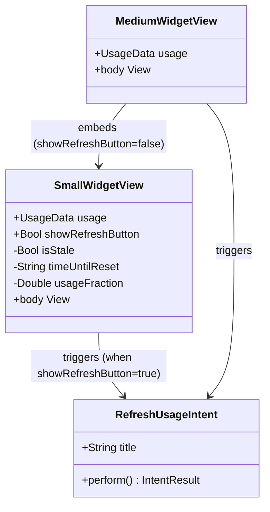

# Make Refresh Button Visible and Deduplicated Across Widget Sizes

## Requirements
Improve discoverability of the manual refresh action by making the refresh button visually prominent on both small and medium widgets, and eliminate the duplicate refresh button that currently appears in the medium widget due to `SmallWidgetView` being embedded alongside a second button in the right pane.

## Entities

## Approach
1. Button Visibility Enhancement:
   - Upgrade refresh button foreground style from `.tertiary` to `.secondary` in both `SmallWidgetView` and `MediumWidgetView`
   - Increase icon size from `.system(size: 9)` to `.system(size: 11)` for better tap affordance and discoverability
   - No background layer needed; `.secondary` provides sufficient contrast on the widget canvas

2. Deduplication via Optional Parameter:
   - Add `showRefreshButton: Bool = true` to `SmallWidgetView` to give callers control over whether the button renders
   - `MediumWidgetView` passes `showRefreshButton: false` when embedding `SmallWidgetView`, so the medium widget shows exactly one refresh button (in the right-pane footer)
   - This keeps `SmallWidgetView` self-contained when used standalone

3. Backward Compatibility:
   - `showRefreshButton` defaults to `true` — all existing call sites (previews, `WidgetEntryView` default branch) compile and behave identically without change
   - No new models, services, or intents required — view-layer change only

## Structure

### Inheritance Relationships
1. `SmallWidgetView` conforms to `View` (unchanged)
2. `MediumWidgetView` conforms to `View` (unchanged)
3. `RefreshUsageIntent` conforms to `AppIntent` (unchanged)

### Dependencies
1. `SmallWidgetView` optionally renders `Button(intent: RefreshUsageIntent())` controlled by `showRefreshButton`
2. `MediumWidgetView` embeds `SmallWidgetView(usage:showRefreshButton:)` passing `false`
3. `MediumWidgetView` renders its own `Button(intent: RefreshUsageIntent())` in the right-pane footer
4. No changes to `WidgetEntryView`, `UsageProvider`, or any service/model types

### Layered Architecture
1. View Layer: `SmallWidgetView` and `MediumWidgetView` — UI-only changes
2. Intent Layer: `RefreshUsageIntent` — triggers `WidgetCenter.shared.reloadTimelines` (unchanged)
3. Service / Model layers: untouched

## Operations

### Update View - SmallWidgetView
1. Responsibility: Render a full-width refresh button at the top of the widget, followed by the 5-hour usage arc and labels
2. Attributes:
   - `usage`: `UsageData` — existing, unchanged
   - `showRefreshButton`: `Bool` — new parameter; insert after `usage`; default value `true`
3. Methods:
   - `body`: `some View`
     - Logic:
       - Replace the `ZStack(alignment: .bottomTrailing)` with a plain `VStack(spacing: 4)`
       - As the first item in the VStack, conditionally render the button: `if showRefreshButton { ... }`
       - Button label: `Label("Refresh", systemImage: "arrow.clockwise")` with `.font(.caption2)` and `.frame(maxWidth: .infinity)`
       - Button style: `.buttonStyle(.bordered)`
       - Below the button: `progressArc`, `usageText`, `resetLabel`, then `if isStale { staleLabel }` — all unchanged
       - Move `.padding(10)` to the outer VStack (was on the inner VStack inside ZStack)
4. Annotations: `struct SmallWidgetView: View` — no annotation changes
5. Constraints:
   - `showRefreshButton` must default to `true`
   - Do not alter the arc shape, label subviews, or their order below the button

### Update View - MediumWidgetView
1. Responsibility: Render the two-column medium widget; embed `SmallWidgetView` without its own button to avoid duplication; show a single, more visible refresh button in the right-pane footer
2. Attributes:
   - `usage`: `UsageData` — existing, unchanged
3. Methods:
   - `body`: `some View`
     - Logic:
       - Change `SmallWidgetView(usage: usage)` to `SmallWidgetView(usage: usage, showRefreshButton: false)`
       - In the right-pane footer `HStack`, locate the existing `Button(intent: RefreshUsageIntent())` label:
         - Change `.font(.system(size: 9))` to `.font(.system(size: 11))`
         - Change `.foregroundStyle(.tertiary)` to `.foregroundStyle(.secondary)`
       - No other structural changes to the `HStack`/`Divider`/`VStack` layout
4. Annotations: `struct MediumWidgetView: View` — no change
5. Constraints:
   - Do not add a second refresh button in the medium widget
   - Do not change the "Updated X ago" text or its styling

## Norms
1. SwiftUI Standards: Use `struct` views with `let` stored properties; no `@State` needed for this change
2. WidgetKit Button Rule: Widget buttons must use `Button(intent:)` with an `AppIntent`; `Button(action:)` is not supported in widget extensions — do not change the intent wiring
3. Visibility Styling: `.secondary` foreground style for interactive chrome the user should notice; `.tertiary` reserved for purely decorative or redundant elements
4. Default Parameters: New parameters added to existing views must default to the value that preserves current external behaviour, ensuring no call-site changes are required
5. No Comments: Omit inline comments unless explaining a non-obvious WidgetKit or platform constraint

## Safeguards
1. Functional Constraint: The refresh button must trigger `RefreshUsageIntent` — do not alter the intent type or invoke `WidgetCenter` directly from the view
2. Duplication Constraint: The medium widget must render exactly one visible refresh button; `SmallWidgetView` embedded inside `MediumWidgetView` must pass `showRefreshButton: false`
3. Backward Compatibility: The standalone small widget path in `WidgetEntryView` (`default:` branch calling `SmallWidgetView(usage:)`) must continue to show the refresh button without any call-site modification — enforced by `showRefreshButton` defaulting to `true`
4. Size Constraint: Icon size must not exceed `.system(size: 13)` to avoid crowding the small widget's 154×154 pt canvas
5. Preview Validity: Existing `#Preview` macros in `SmallWidgetView.swift` and `MediumWidgetView.swift` must continue to compile and render correctly without modification
6. Scope Constraint: No changes to `RefreshUsageIntent`, `UsageData`, `UsageEntry`, `UsageProvider`, `WidgetEntryView`, `ErrorView`, `UnauthenticatedView`, or any service/cache type
7. Platform Constraint: Target macOS 26.0 / Swift 5.9; do not introduce APIs unavailable before macOS 26.0
